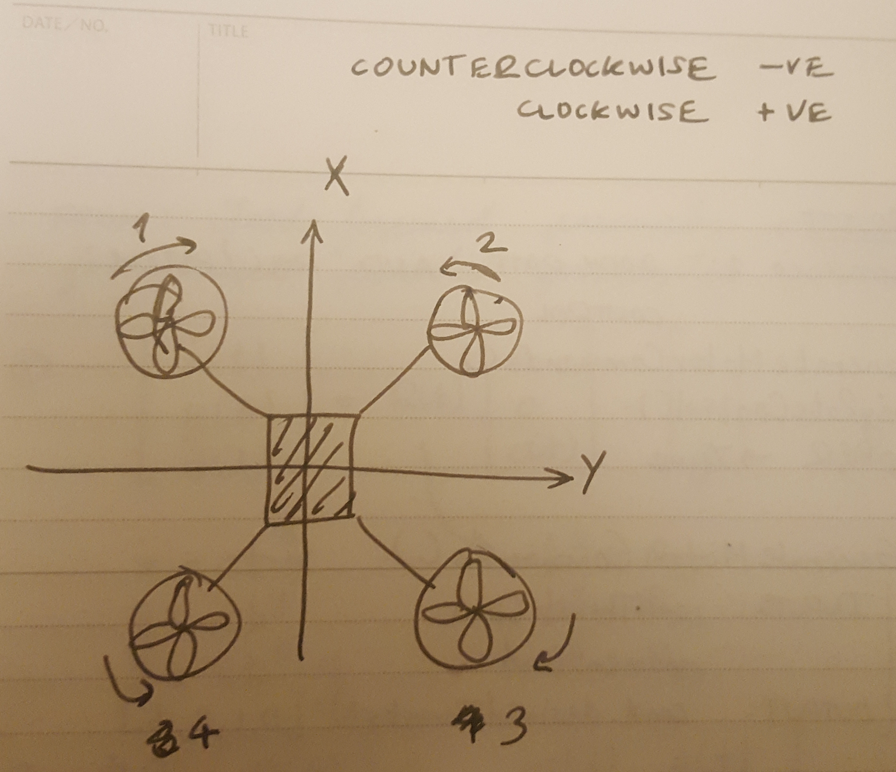
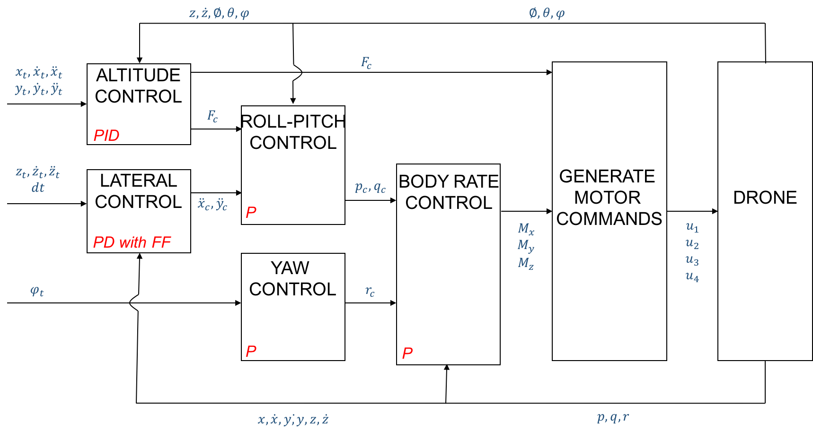

### Rubric : Implemented body rate control in C++ ###
The controller should be a proportional controller on body rates to commanded moments. The controller should take into account the moments of inertia of the drone when calculating the commanded moments.

--> The 'BodyRateController' function is implemented from line 93 to line 120 in 'QuadControl.cpp'.

### Rubric : Implement roll pitch control in C++ ###
The controller should use the acceleration and thrust commands, in addition to the vehicle attitude to output a body rate command. The controller should account for the non-linear transformation from local accelerations to body rates. Note that the drone's mass should be accounted for when calculating the target angles.

--> The 'RollPitchControl' function is implemented from line 122 to line 160 in 'QuadControl.cpp'

### Rubric : Implement altitude controller in C++ ###
The controller should use both the down position and the down velocity to command thrust. Ensure that the output value is indeed thrust (the drone's mass needs to be accounted for) and that the thrust includes the non-linear effects from non-zero roll/pitch angles.
Additionally, the C++ altitude controller should contain an integrator to handle the weight non-idealities presented in scenario 4.
 
--> The 'AltitudeControl' function is implemented from line 162 to line 197 in 'QuadControl.cpp'

### Rubric : Implement lateral position control in C++ ###
The controller should use the local NE position and velocity to generate a commanded local acceleration.

--> The 'LateralPositionControl' function is implemented from line 200 to line 254 in 'QuadControl.cpp'

### Rubric : Implement yaw control in C++ ###
The controller can be a linear/proportional heading controller to yaw rate commands (non-linear transformation not required).

--> The 'YawControl' function is implemented from line 257 to line 284 in 'QuadControl.cpp'

### Rubric : Implement calculating the motor commands given commanded thrust and moments in C++ ###
The thrust and moments should be converted to the appropriate 4 different desired thrust forces for the moments. Ensure that the dimensions of the drone are properly accounted for when calculating thrust from moments.

--> The function GenerateMotorCommands() to convert the required thrust and moments to motor commands is implemented from line 56 to line 91 in 'QuadControl.cpp'. The below diagram shows the assumptions in terms of directional and rotational axes.

### Rubric : Evaluation of flight performance for various scenarios ###
I implemented different control functions for the control architecture in the order recommended by the README.md file in the project repository. The overall control flow was slightly different from the lectures and is shown in the image below.

Mass of the quadroter is fixed at 0.5kg based on Scenario1. 
Roll and pitch parts of kpPQR (angle rate gains) was tuned in Scenario2 to adjust vehicle attitude, although these were slightly tuned later on after all controllers were implemented.
Position control gains were implemented and tuned for Scenario3 (position control). Initially only kpPosXY, kpPosZ, kpVelXY and kpVelZ were tuned for LateralPositionControl() and AltitudeControl(). kpYaw was tuned separately for YawControl() for one of the quadroters in Scenario3 and the yaw portion of kpPQR was also subsequently tuned.
Scenario4 had 3 quadroters with different initial conditions (mass, attitude, velocities), trying to get from point A to point B. To tune the green quadroter, position control parameters were re-tuned. The red quadroter had a fixed offset in Z. In such situations, integral control is usually implemented. This was implemented in the AltitudeControl() function.

Finally, in Scenario5 the parameters were tweaked slightly tu reduce error for quad2. quad1 still has a higher error and I will be working on tuning this further in the future. From the fixed offset error in X and Y, it seems that LateralControl could need an integral controller. Also, quad1 does not seem to have feed-forward because of which it is slowing down on straight sections compared to trajectory. This can be improved by feed-forward that quad2 seems to have.